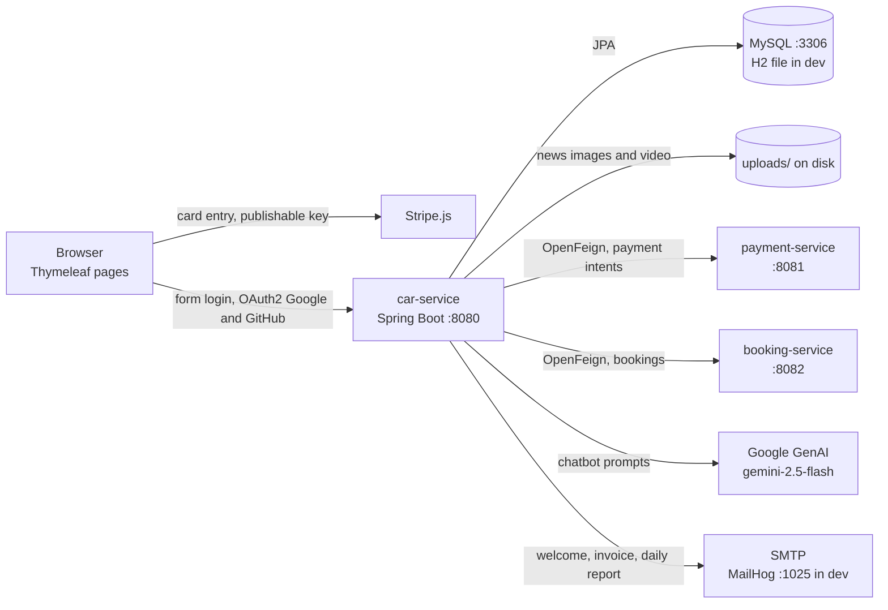

# Car Service

A Spring Boot application for managing car service operations. It exposes a web UI with Thymeleaf and REST endpoints, integrates with external microservices for booking and payment, and supports OAuth2 login.

> Last updated: 2026-09-03

## Architecture

`car-service` is the web application: it renders every page, owns the users, vehicles, service
catalogue and invoices, and calls out to two sibling services for bookings and payments. Those two
are separate deployments with their own repositories.

| Component | Repository | Port | Store | Required? |
| --- | --- | --- | --- | --- |
| **car-service** (this repo) | — | 8080 | MySQL, or H2 file in `dev` | yes |
| **payment-service** | [payment-service](https://github.com/PhoenixMaster123/payment-service) | 8081 | own | for checkout |
| **booking-service** | [booking-service](https://github.com/PhoenixMaster123/booking-service) | 8082 | own | for bookings |
| **MailHog** | — | 1025 / 8025 | — | dev only |

Neither service degrades gracefully today: with `booking-service` unreachable, creating a booking
throws and checkout fails rather than falling back.



### Ports

| Port | What |
| --- | --- |
| 8080 | car-service (HTTP) |
| 8081 | payment-service |
| 8082 | booking-service |
| 3306 | MySQL, default profile |
| 1025 | MailHog SMTP, dev profile |
| 8025 | MailHog web UI, dev profile |

### Modules

Sources are organised by feature under `springboot.bg.harisauto`:

| Package | Responsibility |
| --- | --- |
| `user`, `vehicle` | Accounts, roles, and the vehicles a user owns |
| `service` | The service catalogue and its categories |
| `cart` | Session-scoped shopping cart |
| `booking`, `payment` | OpenFeign clients and DTOs for the two sibling services |
| `invoice` | Invoice model, numbering, and PDF rendering via openhtmltopdf |
| `news` | Admin-managed news articles with image and video upload |
| `chatbot` | Google GenAI client and the `/api/gemini` endpoint |
| `email` | Welcome, invoice and daily-report mail |
| `job` | Scheduled cleanup and reporting tasks |
| `web` | Thymeleaf controllers, DTOs and mappers |
| `common` | Security, AOP logging, exception handling, configuration |

### Scheduled work

| When | Job | What |
| --- | --- | --- |
| 02:00 daily | `BookingCleanupJob` | Cancels bookings whose date has passed |
| 03:00 Sundays | `BookingCleanupJob` | Archives old bookings |
| 08:00 daily | `DailyReportJob` | Emails user and invoice totals to the admin address |

## Stack
- Language: Java 17
- Build tool: Maven (wrapper included: `mvnw`/`mvnw.cmd`)
- Frameworks:
  - Spring Boot 3.4.0
  - Spring Cloud 2024.0.2
  - Springdoc OpenAPI
- Databases:
  - MySQL (default profile)
  - H2 file DB (dev profile)
- Front-End:
  - Thymeleaf
- Spring AI:
  -  Google GenAI
- PDF: openhtmltopdf (invoice rendering)
- Other: Lombok, Apache Commons Lang, Checkstyle

## Entry Point
- Main class: `springboot.bg.harisauto.Application`
- Runs on port `8080` by default (configurable via `server.port`).

## Requirements
- JDK 17+
- Maven 3.9+ (or use the provided Maven wrapper)
- MySQL 8.x (for default profile) or Docker for MailHog (optional for dev email testing)

## Quick Start
- Run with default profile (MySQL required):
  ```bash
  ./mvnw spring-boot:run
  ```
- Run with dev profile (H2 + MailHog):
  ```bash
  # start MailHog (optional but recommended for dev profile)
  docker compose -f docker-compose-mailhog.yml up -d

  # run app with dev profile
  ./mvnw spring-boot:run -Dspring-boot.run.profiles=dev
  ```

## API Docs
- Swagger UI: `http://localhost:8080/swagger-ui/index.html`

## Scripts and Tooling
- `check.sh` — runs Checkstyle and opens the HTML report (note: has convenience for WSL + Windows Explorer).
- Maven wrapper — use `./mvnw` instead of globally installed Maven.
- Optional: `docker-compose-mailhog.yml` — starts MailHog on ports 1025 (SMTP) and 8025 (Web UI).

## Configuration and Environment Variables
Configuration lives primarily in:
- `src/main/resources/application.yml` (default)
- `src/main/resources/application-dev.yml` (dev profile)
- `src/test/resources/application-test.yml` (tests)

Set these environment variables before running the app (copy/paste ready):
```bash
# Database (default profile uses MySQL)
export DB_USERNAME="your_database_username"
export DB_PASSWORD="your_database_password"

# Outbound email (default profile uses Gmail SMTP)
export EMAIL_USERNAME="your_gmail_address"
export EMAIL_PASSWORD="your_app_password"

# OAuth2 login
export GOOGLE_CLIENT_ID="your_google_client_id"
export GOOGLE_CLIENT_SECRET="your_google_client_secret"
export GITHUB_CLIENT_ID="your_github_client_id"
export GITHUB_CLIENT_SECRET="your_github_client_secret"

# AI (Gemini)
export GEMINI_API_KEY="your_gemini_api_key"

# Payments (Stripe)
export STRIPE_PUBLIC_KEY="your_stripe_public_key"
```

Explanation and where to obtain keys:
- DB_USERNAME / DB_PASSWORD — MySQL credentials; create a user with access to database `car_service_db`. <br>Docs: https://dev.mysql.com/doc/
- EMAIL_USERNAME / EMAIL_PASSWORD — Gmail SMTP account; for Gmail you need an App Password when 2FA is enabled. <br>Docs: https://support.google.com/accounts/answer/185833
- GOOGLE_CLIENT_ID / GOOGLE_CLIENT_SECRET — Create OAuth 2.0 Client ID (Web application) in Google Cloud Console. <br>Docs: https://developers.google.com/identity/protocols/oauth2
- GITHUB_CLIENT_ID / GITHUB_CLIENT_SECRET — Create an OAuth app in GitHub Settings → Developer settings → OAuth Apps. <br>Docs: https://docs.github.com/apps/oauth-apps/building-oauth-apps/creating-an-oauth-app
- GEMINI_API_KEY — Obtain from Google AI Studio. <br>Docs: https://ai.google.dev/
- STRIPE_PUBLIC_KEY — Obtain the publishable key from Stripe Dashboard. <br>Docs: https://stripe.com/docs/keys

Additional service endpoints configured in `application.yml`:
- `payment-service.url` — default `http://localhost:8081`
- `booking-service.url` — default `http://localhost:8082`

## Profiles
- Default (no profile):
  - MySQL datasource `jdbc:mysql://localhost:3306/car_service_db?createDatabaseIfNotExist=true`
  - Gmail SMTP on port 587, TLS
  - OpenAPI at `/swagger-ui.html`
- `dev` profile:
  - H2 file DB at `./data/testdb` with web console at `/h2-console`
  - MailHog SMTP on `localhost:1025`, UI at `http://localhost:8025`
  - Redis cache configured (localhost:6379)

## Microservices
This service communicates with external microservices via OpenFeign:
- Payment Service — base URL: `${payment-service.url}` (default `http://localhost:8081`).
    - Link: [payment-service](https://github.com/PhoenixMaster123/payment-service)
- Booking Service — base URL: `${booking-service.url}` (default `http://localhost:8082`).
  - Link: [booking-service](https://github.com/PhoenixMaster123/booking-service)

## Project Structure
Top-level
- `pom.xml` — Maven configuration
- `src/main/java` — Application sources
- `src/main/resources` — App configuration, templates, static assets
- `src/test/java` — Tests
- `docker-compose-mailhog.yml` — Dev email testing container
- `check.sh` — Checkstyle helper

```
Java packages
├─ api/                       # API docs or specs (if used)
├─ checkstyle/                # Checkstyle configuration
├─ data/                      # Local data (e.g., H2 file DB path)
├─ docker-compose-mailhog.yml # Dev SMTP testing tool
├─ pom.xml                    # Maven build descriptor
springboot.bg.harisauto
├── booking
│   ├── client
│   ├── dto
│   │   ├── request
│   │   └── response
│   └── service
│
├── cart
│
├── chatbot
│   ├── controller
│   ├── dto
│   └── service
│
├── common
│   ├── config
│   │   ├── ai
│   │   ├── database
│   │   ├── interceptor
│   │   ├── rest
│   │   ├── security
│   │   └── swagger
│   ├── exception
│   ├── init
│   └── logger
│
├── email
│
├── event
│
├── payment
│   ├── client
│   ├── controller
│   ├── dto
│   │   ├── request
│   │   └── response
│
├── service
│   ├── model
│   ├── repository
│   └── service
│
├── user
│   ├── model
│   ├── repository
│   └── service
│
├── validation
│   └── annotations
│
├── vehicle
│   ├── model
│   ├── repository
│   └── service
│
└── web
    ├── controller
    ├── dto
    └── mapper
├─ src/main/resources/
│  ├─ application.yml        # Default profile config (MySQL)
│  ├─ application-dev.yml    # Dev profile (H2, Mailhog)
│  ├─ application-ci.properties # CI profile (H2 in-memory)
```

Resources
- `application.yml` — default configuration, including DB, mail, OAuth, Swagger, service URLs
- `application-dev.yml` — dev profile overrides (H2, MailHog, Redis cache)
- `templates/` — Thymeleaf templates (auth, account, public, etc.)
- `static/` — static assets (CSS, JS)

## Running Tests
- All tests:
  ```bash
  ./mvnw test
  ```

- Run with a specific profile for tests (if needed):
  ```bash
  ./mvnw test -Dspring.profiles.active=test
  ```

## Linting/Style
- Checkstyle report:
  ```bash
  ./mvnw checkstyle:checkstyle
  # or
  bash check.sh
  ```
  Report path: `target/site/checkstyle.html`

## Database
- Default profile uses MySQL with Hibernate `ddl-auto: update`. Ensure MySQL is running and accessible.
- Dev profile uses H2 with console at `http://localhost:8080/h2-console` (when dev profile is active).

## Authentication & Authorization
- Username/password login with Spring Security (login page `/login`)
- OAuth2 login with Google and GitHub
- Role-based access (`/admin/**` requires `ROLE_ADMIN`)


## Author
- Kristian Popov
  - GitHub: https://github.com/PhoenixMaster123

## License
This project is licensed under the MIT License. For more details, please refer to the file: [LICENSE](LICENSE).
